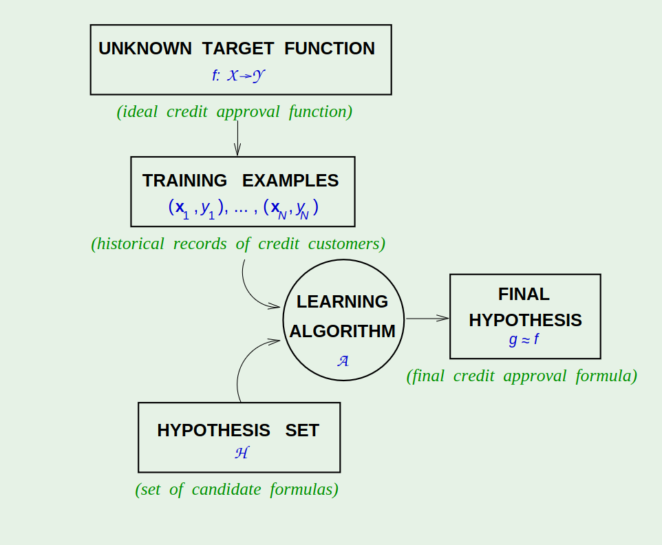

[toc]

# The Problem Setup #

**Example: Predicting how a viewer will rate a movie**
 

**The essence of ML** 

- A pattern exist
- Can not pin it down mathematically
- We have data

## 1.1 Components of Learning ##

***Metaphor:: Credit Approval*** 

### Components ###

- Input $x$ (customer information that is used to make a credit decision)
- Unknown Target Function $f: X \rightarrow Y$ (ideal formula for credit approval)
  > Input Space $X$ (set of all possible inputs $x$)

  > Output Space $Y$ (set of all possible outputs $y$)
- Data set $D$ of input output samples $(x_1, y_1) (x_2, y_2) ... (x_n, y_n)$ where $y_n = f(x_n)$ for  n = 1....N 
(inputs corresponding to previous customers and the correct credit decision for them in hindsight)
- The Learning Algorithm 
  > The hypothesis formula $g: X \rightarrow Y$ choose from the Hypothesis Set

  > The Hypothesis Set $H$

### Process ###
> When a new customer applies for credit(a new $x$),
 
> The bank will base its decision on $g$ (the learning result)

> The decision will be good only to the extent that $g$ faithfully replicates $f$

**In order to get a good $g$ the Algorithm must choose $g$** 

**that best matches $f$ on the training samples of previous customers** 

### Exercise ###
|     | $X$ | $Y$ | $f$ | $D$ |
|---------------- | --------------- | --------------- | --------------- | --------------- |
| a    | All possible medical history and symptoms    | All possible diseases    | ideal formula to identify a patient's problem    | All available patients' infomation and their corresponding correct problem dianostic   |
| b   | All possible handwritten digits   | 0~9 digits   | ideal formula to transfer handwritten digit to correct digit   | handwritten digits and their corresponding correct matches   |
| c   | Infomation of an email   | Spam or not   | ideal formula to decide a email is spam or not   | Spam or not emails that have been identified   |
| d   | Price of electric,temperature,day of the week   | electric load   | ideal formula that gives exact electric load for a given $X$   | historical electric load with corresponding price, temperature and day of the week information   |
| e   | learing methods and personal infomation | the best learning method for yourself   | ideal function that choose the best learning method for you   | personal type based on their personal infomation and the corresponding best learning method   |

## 1.2 A Simple Learning Model ##

### Perceptron Model
- $X = \mathbb{R}^d$ 
- $Y = {+1, -1}$
- $x \in \mathbb{R}^d$ corresponding to salary , years in residence, outstanding debt and the other data fields in a credit application
- $y$ corresponding to approval credit or not
- $h \in H$
- $h(x)$ gives different weights to the different coordinates of $x$ reflecting their relative importance in the credit decision
  > A threshold value -b

  > Approve Credit if $\sum_{i = 1}^d{w_ix_i} > threshold$

  > Deny Credit if $\sum_{i = 1}^d{w_ix_i} \le threshold$

  > More compactly $h(x) = sign((\sum_{i = 1}^d{w_ix_i}) + b)$ (1.1) 
  >
  > where $x_1, ..., x_d$ are the components of the vector $x$
  >
  > The weights are $w_1, ..., w_d$, and the $threshold = -b$
- The learning algorithm will search $H$ by looking for weights and bias that perform well on the data set.
- Some of the weights $w_1, ..., w_d$ may end up being negative, corresponding to an adverse effect on credit approval.
- For instance, the weight of the 'outstanding debt' field should come out negative since more debt is not good for credit.
- The bias value $b$ may end up being large or small, reflecting how lenient or stringent

